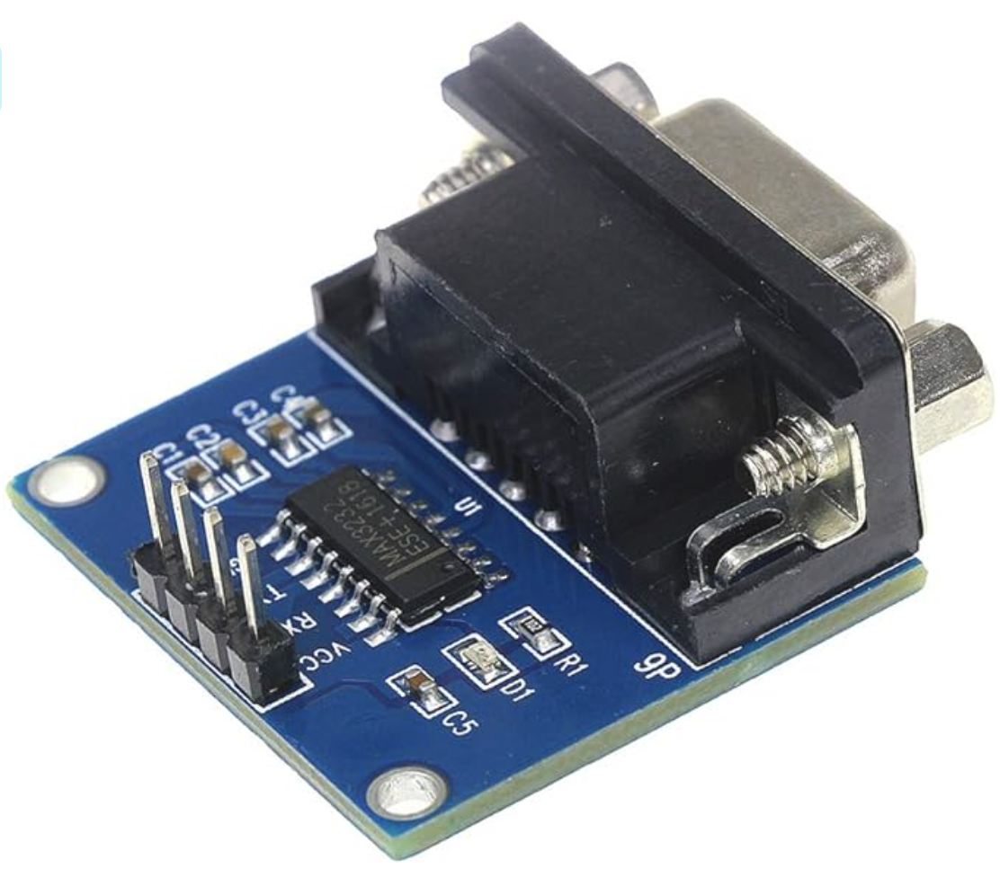
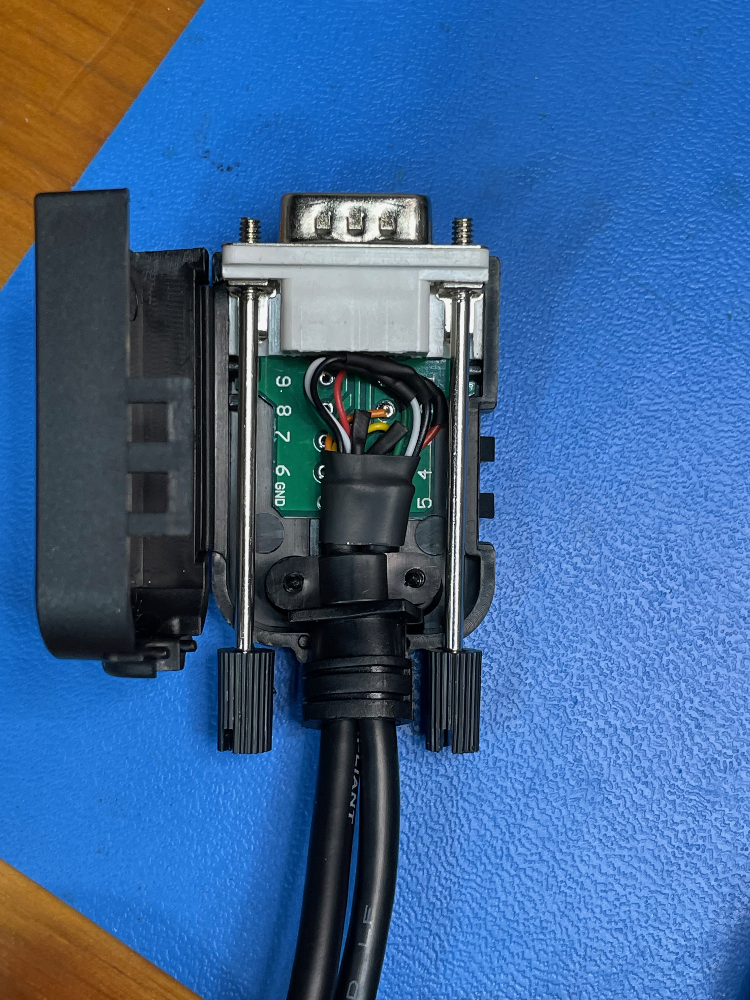

# Onkyo Wired Remote

## Intro

I have fun stereo setup in my living room. It's a nice mix of old and new technology. My 7.1 AV receiver is an Onkyo TX-RZ800, which even at 10+ years old is still an awesome and powerful system. Recently my son starting getting into audio cassettes thanks to the Magnus Archive, and I brought up a 1980s vintage tape deck I fixed a couple year ago. I already had a couple of devices in the audio stack, and so I decided it was time to build a proper audio stack.

Here is the finished product:

Here's the gear list

* Onkyo TX-RZ800 7.1 AV Receiver
* UTurn Audio Orbit Turntable
* Kenwood Cassette Deck
* Sony CD/SACD/DVD/BluRay Player
* Off-brand Spectrum Analyzer
* Speakers (not shown)
    * Two Inifity full-range 4-way front tower speakers
    * One Inifity center channel speaker bar
    * Four Inifity 2-way surround speakers
    * REL subwoofer

The turntable is made by a company here in Boston. Great sound especially if your records are clean and in good shape. I bought the Sony player because I wanted to listen to multi-channel CD audio. Eventually we'll have spatial audio music on the streaming platforms and artists will be mixing for it, but for now, the choices are limited. There are some excellent SACDs still out there, and they sound great on a good system like this. Finally, the Spectrum Analyzer is just for fun.

Ok, one thing I don't like about the Onkyo is that the source buttons are tiny and unlit. The buttons can also be mapped to just about anything in the menu, so sometimes the buttons don't reflect what's actually plugged in.

I decided I wanted a proper control panel worthy of my fun modern/vintage setup, and this project was born.

## The Remote

In the picture above, you can see the remote mounted to the wall in the top right corner. Here's the finished project on the bench:

This is a simple 4x3 keypad control that plugs into the serial port (DB9) on the back of the Onkyo receiver. The port on the back is designed to interface with home theatre control equipment, and there's a simple serial protocol for controlling every aspect about on the receiver. This protocol is also available over WiFi, and I have a 3rd party app on my phone that I use to adjust individual channel levels and other things.

The keypad uses an [Adafruit Feather ItsyBitsy M4](https://www.adafruit.com/product/3800) board as the microprocessor, a [TTL-to-RS232 line driver](https://www.amazon.com/gp/product/B00LPK0Z9A) to interface with the DB9 connection on the stereo, 12 [NKK lighted momentarily-on pushbutton switches]((https://www.digikey.com/en/products/detail/nkk-switches/UB215KKW016B-1JB/1054375)), a [59711 12-channel LED controller](https://www.adafruit.com/product/1455) for the switch LEDs, and a [capacitive touch sensor](https://www.adafruit.com/product/1374). All of this stuff is crammed into a 3D-printed housing.

Before I get into the build, let me say **[CircuitPython](https://circuitpython.org/) rocks!!** I will never go back to C for building these simple maker projects. If you haven't heard of CircuitPython, stop reading this and go check it out.

## Build Steps

### Can I control the Onkyo over serial?

Before I got too far into this project, I wanted to see how easy it was to control the Onkyo over the serial port*. I bought a [USB-C Serial Adapter](https://www.amazon.com/gp/product/B075GV6VL1/) from Amazon. **NOTE: I believe I needed to use a null modem in order to get communications working.** I can't remember for sure. If you're not familiar with the DB9 connector, it's pretty common that Pins 2 and 3 (RX and TX) need to be swapped when connecting laptops and peripheral devices. The null modem does that for you.

 

Armed with this I opened a serial connection (9600, n, 8, 1) to the Onkyo and turned it on. I got a flurry of messages from the receiver. In the code repo, there are a couple of spreadsheets I found online with all of the commands supported by the protocol. It takes a little fiddling, but once you figure out the command structure, you have complete control over the receiver.

*Let me make a quick plug here for the [Serial 2](https://www.decisivetactics.com/) app from Decisive Tactics. It's a Mac-specific serial terminal emulator that works so much better than the free stuff out there. If you're going to work in CircuitPython, you'll want to have a serial connection open to your M4 board, which it does automatically when you plug the M4 into your laptop. This is how you see the command line and do print() debugging. So in addition to helping me look at the Onkyo traffic, I used Serial 2 to look at the CircuitPython command line.

### Prototyping with the NeoTrellis keypad

Next I wanted to write some code to see how easy it was to control a serial port. To further prototype, I bought a 4x4 [Neo Trellis](https://www.adafruit.com/product/4352) kit from AdaFruit. (Video credit: AdaFruit)

<video preload="auto" muted loop playsinline width="512" height="384">
<source src="images/4352-08.mp4" type="video/mp4" />
</video>

This keypad combined with an M4 board and a [TTL-to-RS232 line driver](https://www.amazon.com/gp/product/B00LPK0Z9A/) gave me enough to write some code.

There's some code in the repo (main-trellis.py) that shows some initial tests of this, although it's not the final design. Thanks to CircuitPython, handling serial is a breeze, and I was able to write enough code to satisfy myself that I should build the real thing.

### Building my own lighted keypad

The [lighted NKK switches](https://www.digikey.com/en/products/detail/nkk-switches/UB215KKW016B-1JB/1054375) were a specific choice for this project. They're a splurge, for sure, but I wanted something reminiscent of the old video switchers back in the analog days of video production, and NKK switches are some of the best out there.

I started by 3D printing a small housing to hold a couple of the switches for testing. In case you're wondering, a 17.5 mm square is the perfect size to get these switched to clip in snugly.

The Feather M4 has a ton of I/O pins, and I had enough pins to directly PWM each of the 12 LED buttons. But the white LEDs in the NKK switches require a voltage drop of 3.2 V. The M4 has 3.3 V logic, and I couldn't quite drive enough current through each LED directly from the processor to get 15 mA (the recommended current). Thankfully I found the [12-channel 59711 LED driver](https://www.adafruit.com/product/1455).  

This chip can supply a lot more than 15 mA to each of its channels. There's a single current limiting resistor, so you don't need one for each LED channel. And there are drivers in CircuitPython to drive this chip with SPI. Plus, it's easy to get cool dimming effects, which I definitely used.

### Building the case, and a last-minute added pushbutton

Once I was happy with the LED effects, I turned my attention to designing the final housing. The CAD files are in the repo if you need them.

 

While it's a little bigger than the prototype, it's still a decent size.

I wasn't sure how I was going to fit all the little boards in there, so I did some dry fitting. I opted to just drill the holes I needed on the bottom rather than reprint the case.

That second small hole was a last-minute decision to add an extra button. I wasn't sure yet was I was going to use it for in the code, but I thought it might be useful to have a button to dim the LEDs.

Finally, to label the buttons, I used my label maker with black-on-clear tape. On the NKK switches, the bezel and diffuser pop out with a little bit of effort. The label sticks nicely to the diffuser.

### Wiring things up

Note: If someone is really interested in reproducing this, I'll draw up a schematic. The pin assignments are in the code, though.

Anyway, since I didn't try to build a PCB, there's a lot of soldering and jumper wires in this project! The keypad buttons are wired in a 4x3 row-column matrix. You can see the little row and column jumpers on the switches in this pic below. The YEL, RED, GRN, and PUR wires sticking out on the left are the rows. The three BLK wires on the right are the columns.

The LED driver chip uses a common anode (+) wiring. This means that all of the positives are tied together and wired to 5 V (the USB pin on the M4). The cathodes (-) are soldered to each individual LED channel on the driver chip. You can see that jumble of 12 wires coming out the bottom.

The other tricky wiring was the DB9 connector. I bought a [breakout DB9 connector](https://www.amazon.com/gp/product/B08P77B15L) and took the headers off. In order to have just a single wire going to the keypad, I used a multi-conductor wire that had 3 lines for RS232 serial (GND, TX, RX) and 4 lines for USB power & data (GND, VCC, D+, D-). You can see in the picture below that the USB cable was soldered directly to the multi-conductor wire (RED, BLK, GRN, WHT). I used three additional colors to connect to Pin 5, Pin 2, and Pin 3 on the DB9. These are wired into the TTL-to-RS232 line driver in the keypad.

Again, the purpose of this was to have one wire going into the keypad that carried both the signals from the Onkyo and the power/data from the USB plug. When the USB is just plugged into a power supply, it just supplies power. When it's plugged into a laptop, you have full access to the CircuitPython environment and can update code or look at the console output.

Here's the finished product with everything soldered in, including a prox board which I'll talk about next. It's not super pretty, but for a one-off device, it's fine.

### But wait...what about proximity sensing?

At the last minute, I though to myself that it would be fun if this device would light up when you touched it. The idea behind this was that if the lights were low in my living room and I could't read the buttons, I could touch the case and get all the lights to come on.

Unsurprisingly, there's a small [dev board](https://www.adafruit.com/product/1374) for this on AdaFruit. This board is a capacitive touch/prox sensor. You can attach an external wire to it to extend the area of detection. In the picture below you can see the prox board and the sensing wire pushed up against the front of the housing and glued in place. I drew a purple line to show you the prox sending wire routing.

My experience with prox sensors if that they work best in devices that are grounded. Since this keypad ultimately connects to ground at the USB power supply and ground on the receiver, it ended up working pretty well. In the code, I have all of the keys light up when proxy is triggered, and then they fade out if you don't select anything. The LEDs aren't as bright as this bad iPhone video shows, but you get the idea.

<video preload="auto" muted loop playsinline width="360" height="640">
<source src="images/IMG_8057.mp4" type="video/mp4" />
</video>

### Other possible ways to design this

I'm very happy with how this turned out. It was exactly the "old-school control center vibe" that I wanted, and the functionality is a great addition to my AV setup. As with any project, there were multiple choices to build it.

* **Buy a used Crestron system.** Crestron is the product you see in conference rooms and other venues for controlling stuff. It's pricey, but I could have looked into a used controller.
* **Use WiFi instead of serial.** The protocol works equally well over wifi, so I didn't really need that DB9 cable and the crazy wiring in the DB9 breakout. But I do like the old-school nature of plugging it in.
* **Use a StreamDeck and a Raspberry Pi.** I thought long and hard about this. StreamDecks are cool, programmable controllers that have colorful and fully customizable button images. And there's a [Raspberry Pi library](https://stream-pi.com/) for them. I even had an extra StreamDeck and an older Raspberry Pi lying around. But in the end I wanted something custom-built just for this purpose.

## Useful Resources

This section just has useful links to a variety of docs.

* [Neotrellis AdaFruit Docs](https://learn.adafruit.com/adafruit-neotrellis/circuitpython-code)
* [Neotrellis CircuitPython](https://docs.circuitpython.org/projects/neotrellis/en/latest/index.html)
* [UART (serial) AdaFruit Docs](https://learn.adafruit.com/circuitpython-essentials/circuitpython-uart-serial)
* [UART (serial) CircuitPython](https://docs.circuitpython.org/en/latest/shared-bindings/busio/index.html#busio.UART)
* [Keypad matrix AdaFruit](https://learn.adafruit.com/key-pad-matrix-scanning-in-circuitpython/keymatrix)
* [Keypad matrix CircuitPython](https://docs.circuitpython.org/en/latest/shared-bindings/keypad/index.html)
* [59711 Adafruit Docs](https://learn.adafruit.com/tlc5947-tlc59711-pwm-led-driver-breakout/python-circuitpython)
* [59711 Adafruit Code](https://github.com/adafruit/Adafruit_TLC59711)
* [59711 CircuitPython](https://docs.circuitpython.org/projects/tlc59711/en/latest/index.html)
